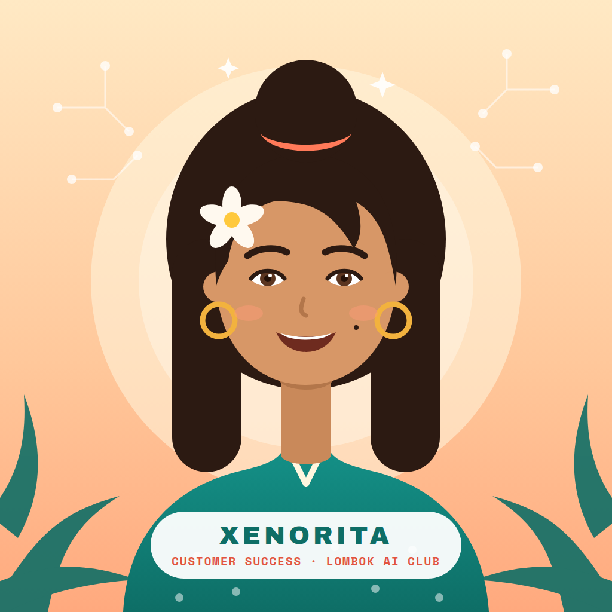
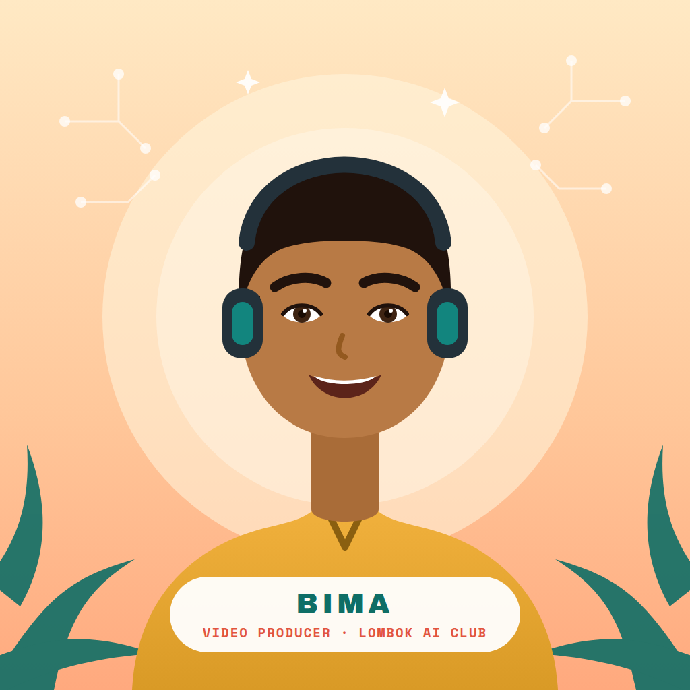
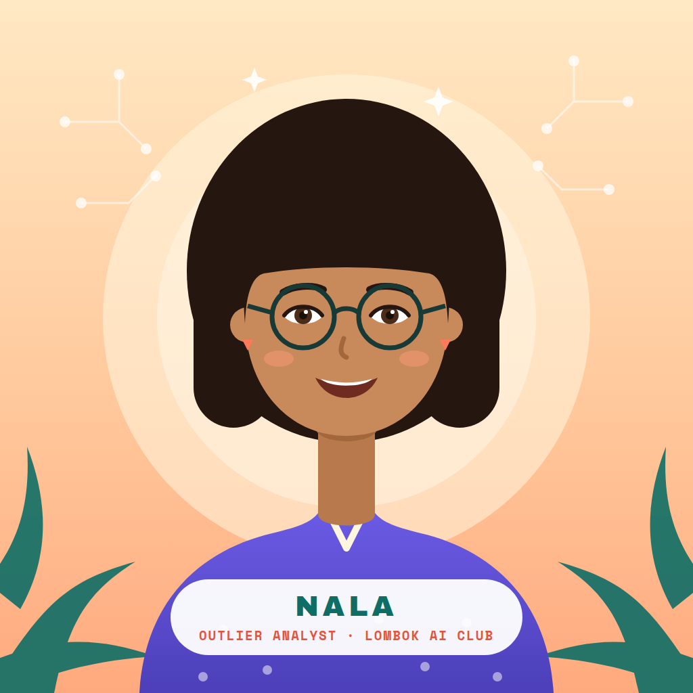

# The Lombok AI Club AI team

The workspace's AI employees. Each persona is the face of one part of the
system — refer to them by name when working in their area. Portraits share one
visual identity (sunset gradient, circuit constellation, palm fronds, brand
fonts); SVG sources sit next to each PNG for edits.

| | Name | Role | Owns | Defined by |
|---|---|---|---|---|
|  | **Xenorita** (she/her) | Customer Success Manager | `.agents/customer-success/` — customer pipeline, follow-ups, self-improving playbook | Full agent: `.claude/agents/xenorita.md` + `/xenorita` skill |
|  | **Rinjani** (she/her) | Content & Social Manager | Social posts, captions, copy, content strategy — always via the `marketing-skills:*` plugin skills | Persona (face of the marketing-skills workflows) |
|  | **Bima** (he/him) | Video Producer | `videos/` — HyperFrames projects: brief → storyboard → composition → MP4 render | Persona (face of the video workflow) |
|  | **Nala** (she/her) | Outlier Analyst | `scripts/outlier-pipeline/` + `dashboard/` — scraping, scoring, Content Studio data | Persona (face of the outlier/dashboard workflow) |

Notes:

- **Only Xenorita is a full agent** with her own memory and behaviors. Rinjani,
  Bima, and Nala are named personas layered on existing workflows — they don't
  change any routing rule in `CLAUDE.md`. Marketing work still goes through the
  marketing-skills plugin; Rinjani is simply who's "doing" it.
- Promoting a persona to a full agent later = give them a
  `.claude/agents/<name>.md` like Xenorita's and (if useful) a memory dir under
  `.agents/`.
- Team roster changes (new hires, renames, role changes) happen in this file.
